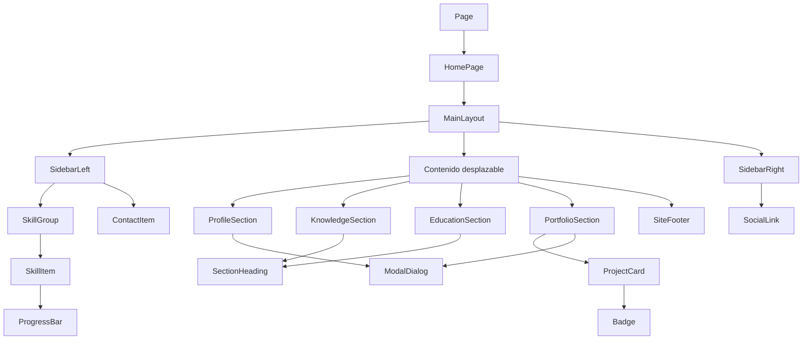

# Portafolio profesional · Ingeniería Web

Portafolio personal de una sola página desarrollado con Next.js, React, TypeScript y Tailwind CSS. Su composición toma como referencia el diseño de Figma adjunto: perfil y habilidades en una barra lateral, contenido principal desplazable y accesos a redes en el extremo derecho.

## Funcionalidades

- Diseño adaptable para escritorio, tablet y móvil.
- Perfil con diálogo personalizado para ampliar la presentación.
- Barras de nivel accesibles para idiomas y tecnologías.
- Tarjetas de conocimientos y línea de tiempo educativa reutilizables.
- Carrusel horizontal de proyectos con controles y diálogos de detalle.
- Enlaces a repositorios y demos listos para añadir a cada proyecto.
- Animaciones sutiles con Framer Motion y respeto por `prefers-reduced-motion`.
- Navegación por teclado, enlace para saltar al contenido y etiquetas semánticas.

## Requisitos

- Node.js 20.9 o posterior.
- npm (incluido con Node.js).

## Instalación y desarrollo

```bash
pnpm install
pnpm dev
```

Abre [http://localhost:3000](http://localhost:3000). Para generar y servir una versión de producción:

```bash
pnpm build
pnpm start
```

## Personalización del contenido

Edita [`src/data/portfolio.ts`](src/data/portfolio.ts) para actualizar perfil, habilidades, educación, proyectos y redes. Confirma especialmente los niveles de idioma y tecnología, las instituciones y las descripciones de proyecto: son contenido inicial editable, no credenciales verificadas. Los campos de correo y enlaces de cada proyecto están vacíos de forma intencional; agrega solo datos y enlaces que quieras publicar.

Reemplaza `public/images/profile.jpg` por una fotografía propia cuadrada, optimizada y con permiso de uso. No es necesario cambiar los componentes para actualizar el contenido.

## Arquitectura

```text
src/
├── app/
│   ├── globals.css           # Tema, estilos responsive y movimiento reducido
│   ├── layout.tsx            # Metadata, idioma y hoja global
│   └── page.tsx              # Entrada de la página
├── components/
│   ├── atoms/                # Button, Badge, ProgressBar, SectionHeading
│   ├── molecules/            # SkillItem, ContactItem, SocialLink, ModalDialog
│   ├── organisms/            # Sidebars y secciones completas
│   ├── templates/            # MainLayout de tres columnas
│   └── HomePage.tsx          # Composición de la página y estado del diálogo
├── data/portfolio.ts         # Contenido tipado y separado de la presentación
└── types/portfolio.ts        # Contratos TypeScript compartidos
```

### Flujo de componentes



Atomic Design agrupa decisiones visuales pequeñas en átomos, composición de datos en moléculas y secciones completas en organismos. `MainLayout` organiza las tres columnas y la página compone el contenido; `portfolio.ts` mantiene los datos fuera del marcado para facilitar cambios y futuras traducciones.

Tailwind CSS 4 define su tema en [`src/app/globals.css`](src/app/globals.css) mediante `@theme`; esta versión no necesita un `tailwind.config.js` para los tokens usados aquí. PostCSS conecta el compilador con Next.js desde `postcss.config.mjs`.

## Dependencias principales

| Paquete | Uso |
| --- | --- |
| `next`, `react`, `react-dom` | Aplicación web, renderizado y componentes |
| `typescript` | Tipado estricto y contratos de datos |
| `tailwindcss`, `@tailwindcss/postcss` | Tema y utilidades CSS |
| `lucide-react` | Iconografía SVG accesible |
| `framer-motion` | Aparición progresiva y microinteracciones |
| `eslint`, `eslint-config-next` | Reglas de calidad para Next.js |

## Despliegue en Vercel

1. Sube la rama `main` al repositorio remoto de GitHub.
2. Importa el repositorio desde el panel de Vercel.
3. Selecciona Next.js como framework; el archivo `vercel.json` ya lo declara.
4. Configura pnpm como gestor del proyecto y conserva los comandos `pnpm install` y `pnpm build`.
5. Despliega y agrega el dominio académico solicitado si está disponible.

No se necesitan variables de entorno para la versión base. No publiques correo, teléfono, dirección ni enlaces privados que no quieras hacer públicos.

## Recomendaciones para la entrega

- Sustituye la foto de referencia, verifica los datos personales y agrega enlaces reales a GitHub, LinkedIn, repositorios y demostraciones.
- Usa imágenes propias u optimizadas y escribe descripciones breves que expliquen problema, aporte y tecnologías.
- Revisa la experiencia en móvil, teclado, contraste, diálogos y desplazamiento horizontal antes de entregar.
- Mantén commits pequeños con mensajes descriptivos y verifica que la rama `main` desplegada corresponda con el último commit de entrega.
- Incluye el enlace de Vercel en el repositorio y confirma el acceso requerido por el docente antes de la fecha límite.

## Licencia

Proyecto académico. Reemplaza o documenta los recursos visuales de terceros antes de publicar una versión comercial.
